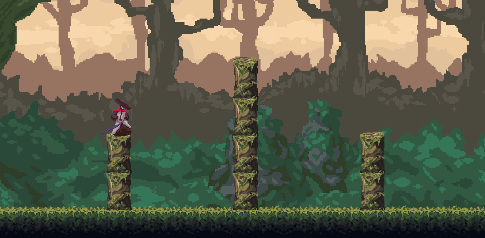
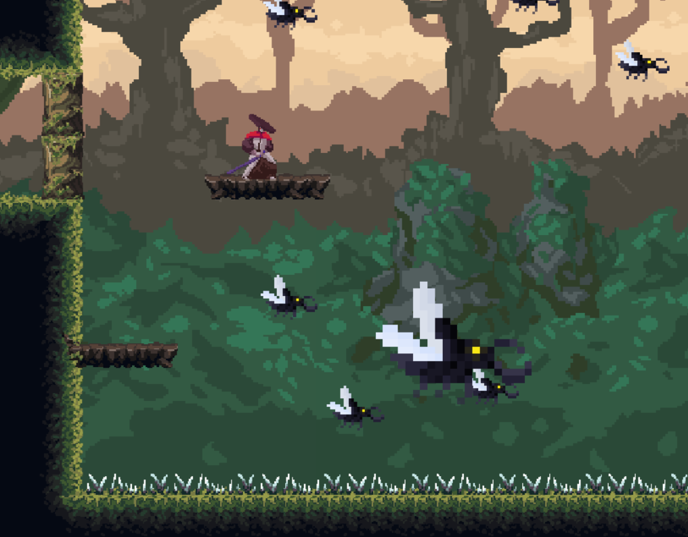
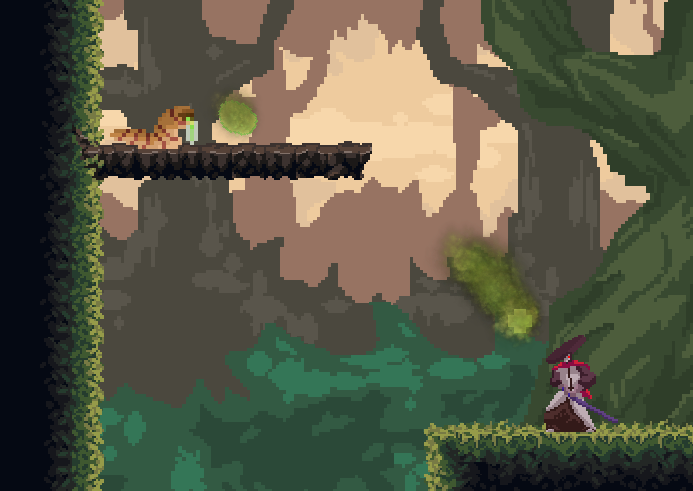
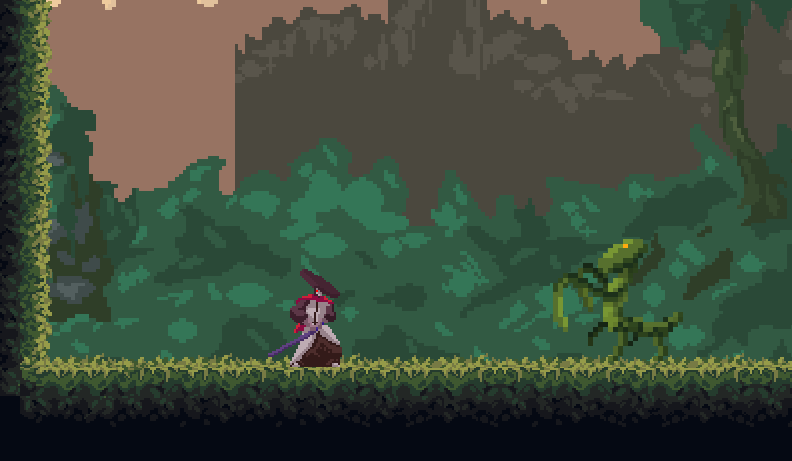
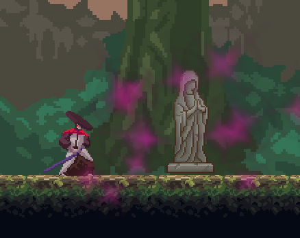

<h1 align="center">
  Forest Ninja
   
</h1>

<h4 align="center">A platformer with combat</h4>

## Inroduction

This game was made during a project in the first year of univerity. It is based on the GXP engine, provided by Saxion Univerity of Applied Sciences.
The game was desgigned and implemented by myself alone, but the assets used are free ones from the web.

## Installation

To play this game you just need to download this repository as a ZIP and extract it to some folder. Then excecute the "GXPEngine.exe" inside the folder "ForestNinjaGame".
It's as easy as that!

If you press "Escape" anytime during the game, you will be transported to the menu screen. The only progressed saved are the doors you've opened,
essential items you've collected, new skills you've lerned and the last checkpoint you've visited.
Be careful though! If you want to continue the game at a later time, you need to exit by pressing "Escape" and then "Quit" in the menu. Otherwise your progress will not be saved!

If you want to start a new game, simply delete the file "saveGame.txt" inside of the folder "ForestNinjaGame".

## Gameplay

Forest Ninja is a game about a ninja who travels through a forest and kills bugs. It's pretty straightforward!

  

It is a 2D platformer with combat. The player can run, jump, use their sword, and perform ranged attacks. During the course of the game, there are new abilities to unlock such as dshing
and a charged attack. There are three different levels, each ending with a specific bossfight.

  

The player will encounter different enemies like the beetle, the ranged maggots which shoots acid at the player, and the very dangerous mantis.

  

  

  

After death the player respawns at the last visited checkpoint.

  

Also this game has a complete tutorial, so even though I would consider this a very hard game, it is very easy to understand.

  

I hope you enjoy this game and manage to beat all the bugs you encounter (pun intended) <3

-Alex
